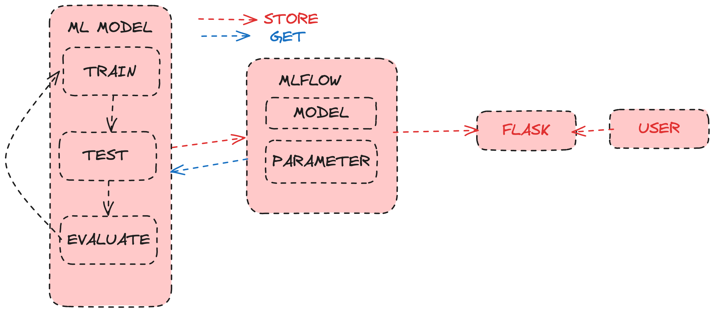

# How to
# Python Environment
1. Create virtual environment by running this command in your terminal: `python -m venv env`
2. Activate the virtual environment by running this command in your terminal: `source env/bin/activate`
3. Install the dependencies by running this command in your terminal: `pip install -r requirements.txt`
4. Run the script by running this command in your terminal: `python /Users/ayyoub/gitrepo/machine_learning/scripts/example_autolog.py`
5. Run Prediction by running this command in your terminal: `python /Users/ayyoub/gitrepo/machine_learning/scripts/predict.py`
6. NOTE: Don't forget to change run id when running predict script
7. It's your turn to try different number of `n_estimators` and find the best setup to improve model prediction.


# Minio and MLFlow Services
1. Start docker service
2. Run `docker-compose up`
3. See the result of MLFlow UI in the browser by going to `localhost:5001`
4. See the result of Minio UI in the browser by going to `localhost:9000`
5. Export all variables in your terminal:
```
export AWS_ACCESS_KEY_ID=minio
export AWS_SECRET_ACCESS_KEY=minio123
export MLFLOW_S3_ENDPOINT_URL=http://localhost:9000
```
6. Go to your Minio UI and create the bucket named `mlflow`


